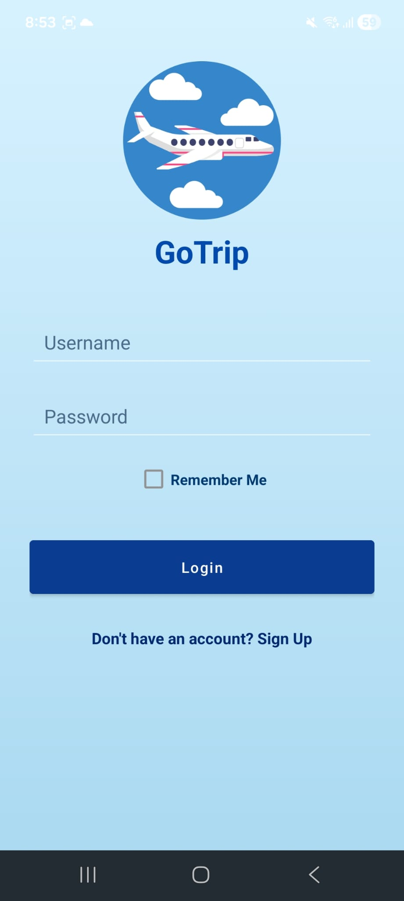
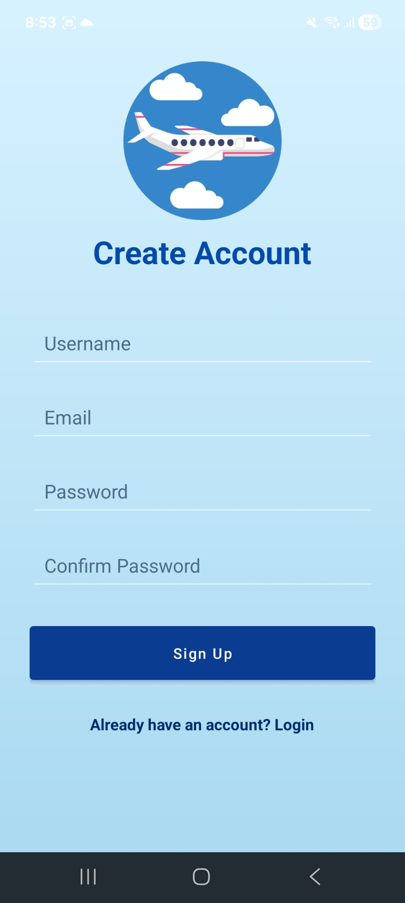
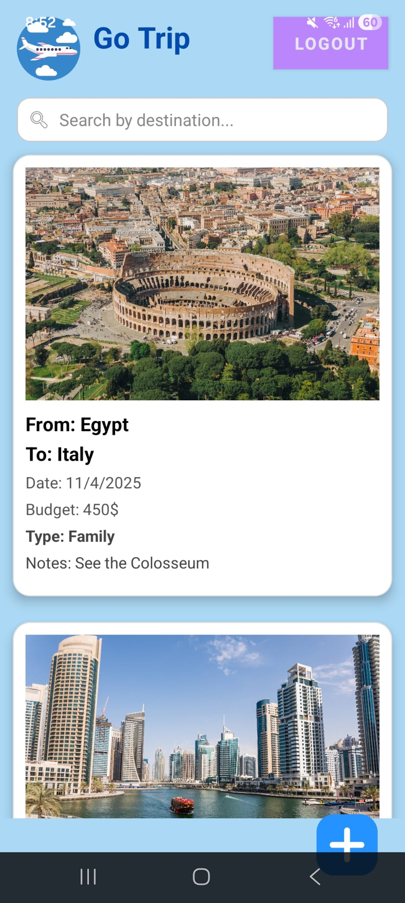
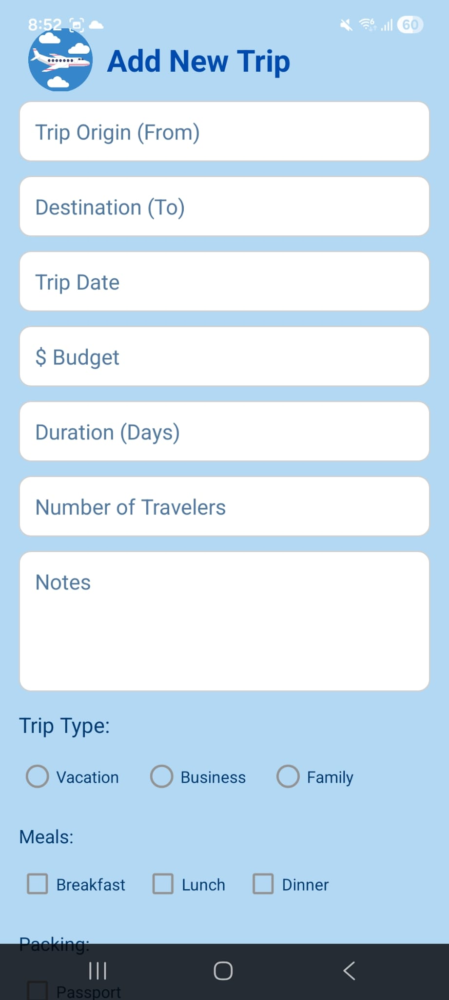
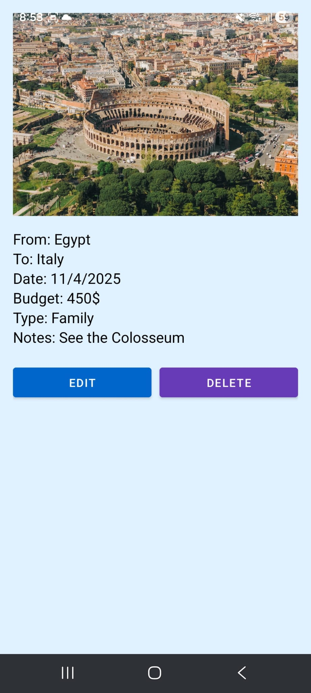
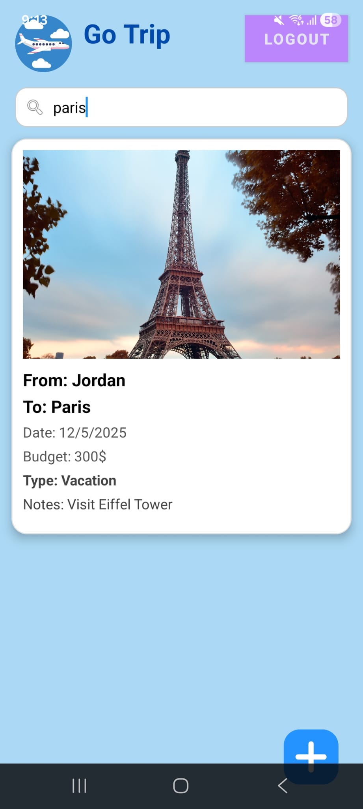

# Trip Planning Mobile App ✈️📱

## Overview

The **Trip Planning Mobile App** is an Android application designed to help users organize and manage tasks related to their trips.
Users can easily create, edit, search, and manage trip tasks such as places to visit, packing items, or travel reminders.

This application was developed as part of a **Mobile Application Development assignment**, focusing on implementing core Android concepts such as activities, RecyclerView, lifecycle management, and local data storage.

---

## Features 🚀

* View trip tasks using **RecyclerView**
* Add new trip tasks
* Edit existing tasks
* Search for tasks
* Select task dates using **Date Picker**
* Use interactive UI elements such as:

  * Radio Buttons
  * CheckBoxes
  * Switches
* Store and manage data locally using **SharedPreferences**
* Simple and user-friendly interface
* Login and registration screens

---

## App Screens 📸

### Sign In Screen

### Sign Up Screen

### Home Screen (Task List)

### Add New Task

### Edit Task

### Search Tasks

---

## Technologies Used 🛠

* Java / Kotlin
* Android Studio
* RecyclerView
* SharedPreferences
* DatePicker
* Android Activities & Lifecycle
* XML Layouts

---

## App Architecture

The application contains multiple activities that manage different parts of the user experience:

* **SignInActivity** – Allows users to log into the application
* **SignUpActivity** – Allows users to create a new account
* **MainActivity** – Displays all trip tasks using RecyclerView
* **AddTaskActivity** – Allows users to add a new task
* **EditTaskActivity** – Allows users to update an existing task

---

## Data Storage

All application data is stored locally using **SharedPreferences**, allowing the app to save and retrieve user tasks efficiently.

---

## How to Run the Project ▶️

1. Clone the repository from **GitHub**
2. Open the project using **Android Studio**
3. Allow Gradle to sync the project
4. Run the application on an emulator or a physical Android device

---

## Demo Video 🎥

A short demonstration video (around 3 minutes) showing the application features can be viewed here:

Google Drive Link:
https://drive.google.com/file/d/1sr8biE_WiHpf5y6FkZGqaaWkl-R6mYnY/view?usp=drive_link

---

## Author 👨‍💻

Developed by: **Aseel Khatib**

Mobile Application Development Assignment – Android
